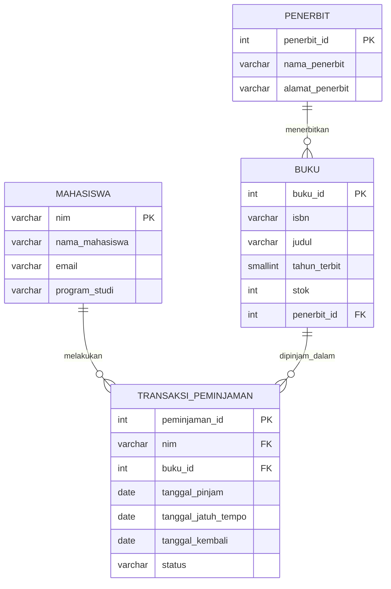

# Tugas Mandiri Modul 6
## Perancangan ERD E-Library Kampus

### Identitas
- Nama: Andi Rosiqah Salsabila
- NIM: D121241030
- Mata Kuliah: Pemrograman Web B
- Tugas Modul 6: Perancangan ERD E-Library Kampus

---

## 1. Deskripsi Sistem

E-Library Kampus merupakan sistem basis data relasional yang digunakan untuk mengelola proses peminjaman buku pada perpustakaan kampus. Sistem menyimpan data mahasiswa, buku, penerbit, serta transaksi peminjaman dan pengembalian buku.

Setiap mahasiswa dapat melakukan beberapa transaksi peminjaman. Setiap buku dapat muncul dalam beberapa transaksi peminjaman pada waktu yang berbeda.
Setiap buku diterbitkan oleh satu penerbit, sedangkan satu penerbit dapat menerbitkan banyak buku.

## 2. Desain ERD Logis

Sistem E-Library Kampus memiliki empat entitas utama, yaitu `mahasiswa`, `buku`, `penerbit`, dan `transaksi_peminjaman`.

Relasi antarentitas adalah sebagai berikut:

1. Satu mahasiswa dapat memiliki banyak transaksi peminjaman.
2. Satu buku dapat tercatat dalam banyak transaksi peminjaman pada waktu yang berbeda.
3. Satu penerbit dapat menerbitkan banyak buku.
4. Setiap transaksi peminjaman berhubungan dengan satu mahasiswa dan satu buku.

Cardinality:

- `mahasiswa` 1 : N `transaksi_peminjaman`
- `buku` 1 : N `transaksi_peminjaman`
- `penerbit` 1 : N `buku`

## 3. Identifikasi Entitas dan Atribut

### 3.1 Entitas Mahasiswa

| Atribut | Keterangan |
|---|---|
| `nim` | Primary Key, identitas unik mahasiswa |
| `nama_mahasiswa` | Nama lengkap mahasiswa |
| `email` | Email mahasiswa |
| `program_studi` | Program studi mahasiswa |

### 3.2 Entitas Penerbit

| Atribut | Keterangan |
|---|---|
| `penerbit_id` | Primary Key, identitas unik penerbit |
| `nama_penerbit` | Nama penerbit |
| `alamat_penerbit` | Alamat penerbit |

### 3.3 Entitas Buku

| Atribut | Keterangan |
|---|---|
| `buku_id` | Primary Key, identitas unik buku |
| `isbn` | Nomor ISBN buku |
| `judul` | Judul buku |
| `tahun_terbit` | Tahun penerbitan buku |
| `stok` | Jumlah buku yang tersedia |
| `penerbit_id` | Foreign Key yang merujuk ke `penerbit.penerbit_id` |

### 3.4 Entitas Transaksi Peminjaman

| Atribut | Keterangan |
|---|---|
| `peminjaman_id` | Primary Key, identitas unik transaksi |
| `nim` | Foreign Key yang merujuk ke `mahasiswa.nim` |
| `buku_id` | Foreign Key yang merujuk ke `buku.buku_id` |
| `tanggal_pinjam` | Tanggal buku dipinjam |
| `tanggal_jatuh_tempo` | Batas waktu pengembalian buku |
| `tanggal_kembali` | Tanggal buku dikembalikan |
| `status` | Status transaksi peminjaman |

## 4. Simulasi Normalisasi

### 4.1 Bentuk Tidak Normal (UNF)

Pada awalnya seluruh data mahasiswa dan buku yang dipinjam dapat disimpan dalam satu tabel besar seperti berikut:

| NIM | Nama Mahasiswa | Email | Program Studi | Buku Dipinjam |
|---|---|---|---|---|
| D121241001 | Andi | andi@student.unhas.ac.id | Teknik Informatika | {B001, Basis Data, Informatika Press, 2026-10-01, 2026-10-08}, {B002, Pemrograman Web, Media Teknologi, 2026-10-01, 2026-10-08} |
| D121241002 | Rina | rina@student.unhas.ac.id | Teknik Informatika | {B001, Basis Data, Informatika Press, 2026-10-02, 2026-10-09} |

Bentuk tersebut termasuk UNF karena kolom `Buku Dipinjam` menyimpan lebih dari satu kelompok nilai dalam satu sel. Data tersebut belum atomik dan memiliki kelompok data berulang.

### 4.2 First Normal Form (1NF)

Agar memenuhi 1NF, setiap sel harus menyimpan satu nilai atomik dan kelompok data berulang harus dihilangkan.

Hasil perubahan menjadi:

| NIM | Buku ID | Tanggal Pinjam | Nama Mahasiswa | Email | Program Studi | ISBN | Judul | Penerbit ID | Nama Penerbit | Alamat Penerbit | Tahun Terbit | Tanggal Jatuh Tempo | Tanggal Kembali | Status |
|---|---|---|---|---|---|---|---|---|---|---|---|---|---|---|
| D121241001 | B001 | 2026-10-01 | Andi | andi@student.unhas.ac.id | Teknik Informatika | 978001 | Basis Data | P001 | Informatika Press | Makassar | 2025 | 2026-10-08 | NULL | Dipinjam |
| D121241001 | B002 | 2026-10-01 | Andi | andi@student.unhas.ac.id | Teknik Informatika | 978002 | Pemrograman Web | P002 | Media Teknologi | Jakarta | 2026 | 2026-10-08 | NULL | Dipinjam |
| D121241002 | B001 | 2026-10-02 | Rina | rina@student.unhas.ac.id | Teknik Informatika | 978001 | Basis Data | P001 | Informatika Press | Makassar | 2025 | 2026-10-09 | NULL | Dipinjam |

Pada tahap ini setiap kolom sudah memiliki nilai atomik sehingga tabel telah memenuhi 1NF.

Kunci dapat dipandang sebagai kombinasi:

`nim + buku_id + tanggal_pinjam`

Kombinasi tersebut diperlukan karena mahasiswa yang sama dapat meminjam buku yang sama lagi pada waktu yang berbeda.

Walaupun sudah memenuhi 1NF, masih terdapat redundansi. Contohnya, nama dan email mahasiswa ditulis berulang setiap kali mahasiswa melakukan peminjaman. Data buku dan penerbit juga berulang pada setiap transaksi.

### 4.3 Second Normal Form (2NF)

Untuk memenuhi 2NF, ketergantungan parsial terhadap sebagian kunci komposit harus dihilangkan.

Ketergantungan yang ditemukan:

- `nim` menentukan `nama_mahasiswa`, `email`, dan `program_studi`.
- `buku_id` menentukan `isbn`, `judul`, `tahun_terbit`, serta informasi penerbit.
- Data transaksi bergantung pada kejadian peminjaman buku oleh mahasiswa.

Oleh karena itu tabel dipisahkan menjadi:

#### Tabel mahasiswa

| nim | nama_mahasiswa | email | program_studi |
|---|---|---|---|
| D121241001 | Andi | andi@student.unhas.ac.id | Teknik Informatika |
| D121241002 | Rina | rina@student.unhas.ac.id | Teknik Informatika |

Primary Key: `nim`

#### Tabel buku

| buku_id | isbn | judul | tahun_terbit | penerbit_id | nama_penerbit | alamat_penerbit |
|---|---|---|---|---|---|---|
| B001 | 978001 | Basis Data | 2025 | P001 | Informatika Press | Makassar |
| B002 | 978002 | Pemrograman Web | 2026 | P002 | Media Teknologi | Jakarta |

Primary Key: `buku_id`

#### Tabel transaksi_peminjaman

| peminjaman_id | nim | buku_id | tanggal_pinjam | tanggal_jatuh_tempo | tanggal_kembali | status |
|---|---|---|---|---|---|---|
| T001 | D121241001 | B001 | 2026-10-01 | 2026-10-08 | NULL | Dipinjam |
| T002 | D121241001 | B002 | 2026-10-01 | 2026-10-08 | NULL | Dipinjam |
| T003 | D121241002 | B001 | 2026-10-02 | 2026-10-09 | NULL | Dipinjam |

Primary Key: `peminjaman_id`

Foreign Key:
- `nim` merujuk ke `mahasiswa.nim`
- `buku_id` merujuk ke `buku.buku_id`

Pada tahap 2NF, informasi mahasiswa tidak lagi berulang pada setiap transaksi.

Namun masih terdapat ketergantungan transitif pada tabel `buku`, yaitu:

`buku_id → penerbit_id → nama_penerbit, alamat_penerbit`

Oleh karena itu struktur masih perlu dinormalisasi ke 3NF.

### 4.4 Third Normal Form (3NF)

Agar memenuhi 3NF, ketergantungan transitif harus dihilangkan.

Pada tabel `buku` terdapat ketergantungan:

`buku_id → penerbit_id → nama_penerbit, alamat_penerbit`

`nama_penerbit` dan `alamat_penerbit` sebenarnya bergantung pada `penerbit_id`, bukan secara langsung pada `buku_id`.

Oleh karena itu data penerbit dipisahkan menjadi tabel tersendiri.

Struktur setelah 3NF:

1. `mahasiswa`
   - `nim` (PK)
   - `nama_mahasiswa`
   - `email`
   - `program_studi`

2. `penerbit`
   - `penerbit_id` (PK)
   - `nama_penerbit`
   - `alamat_penerbit`

3. `buku`
   - `buku_id` (PK)
   - `isbn`
   - `judul`
   - `tahun_terbit`
   - `stok`
   - `penerbit_id` (FK)

4. `transaksi_peminjaman`
   - `peminjaman_id` (PK)
   - `nim` (FK)
   - `buku_id` (FK)
   - `tanggal_pinjam`
   - `tanggal_jatuh_tempo`
   - `tanggal_kembali`
   - `status`

Dengan struktur tersebut, setiap atribut bukan kunci bergantung pada Primary Key tabelnya masing-masing dan tidak terdapat ketergantungan transitif yang tidak diperlukan. Skema telah memenuhi 3NF.

## 5. Rancangan Tabel Akhir

### 5.1 Tabel `mahasiswa`

| Kolom | Tipe Data | Constraint | Keterangan |
|---|---|---|---|
| `nim` | VARCHAR(20) | PRIMARY KEY | Identitas unik mahasiswa |
| `nama_mahasiswa` | VARCHAR(100) | NOT NULL | Nama mahasiswa |
| `email` | VARCHAR(100) | NOT NULL, UNIQUE | Email mahasiswa |
| `program_studi` | VARCHAR(100) | NOT NULL | Program studi |

### 5.2 Tabel `penerbit`

| Kolom | Tipe Data | Constraint | Keterangan |
|---|---|---|---|
| `penerbit_id` | INT UNSIGNED | PRIMARY KEY, AUTO_INCREMENT | Identitas unik penerbit |
| `nama_penerbit` | VARCHAR(100) | NOT NULL | Nama penerbit |
| `alamat_penerbit` | VARCHAR(255) | NULL | Alamat penerbit |

### 5.3 Tabel `buku`

| Kolom | Tipe Data | Constraint | Keterangan |
|---|---|---|---|
| `buku_id` | INT UNSIGNED | PRIMARY KEY, AUTO_INCREMENT | Identitas unik buku |
| `isbn` | VARCHAR(20) | NOT NULL, UNIQUE | ISBN buku |
| `judul` | VARCHAR(255) | NOT NULL | Judul buku |
| `tahun_terbit` | SMALLINT UNSIGNED | NOT NULL | Tahun terbit |
| `stok` | INT UNSIGNED | NOT NULL | Jumlah stok buku |
| `penerbit_id` | INT UNSIGNED | FOREIGN KEY, NOT NULL | Merujuk ke penerbit |

Foreign Key:

`penerbit_id` → `penerbit(penerbit_id)`

### 5.4 Tabel `transaksi_peminjaman`

| Kolom | Tipe Data | Constraint | Keterangan |
|---|---|---|---|
| `peminjaman_id` | INT UNSIGNED | PRIMARY KEY, AUTO_INCREMENT | Identitas unik transaksi |
| `nim` | VARCHAR(20) | FOREIGN KEY, NOT NULL | Mahasiswa peminjam |
| `buku_id` | INT UNSIGNED | FOREIGN KEY, NOT NULL | Buku yang dipinjam |
| `tanggal_pinjam` | DATE | NOT NULL | Tanggal peminjaman |
| `tanggal_jatuh_tempo` | DATE | NOT NULL | Batas pengembalian |
| `tanggal_kembali` | DATE | NULL | Tanggal pengembalian |
| `status` | VARCHAR(20) | NOT NULL | Status peminjaman |

Foreign Key:

- `nim` → `mahasiswa(nim)`
- `buku_id` → `buku(buku_id)`

## 6. Visualisasi Relasi Kunci

